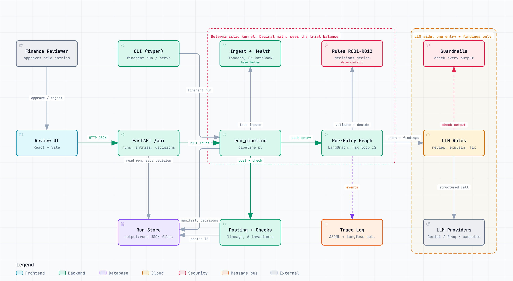
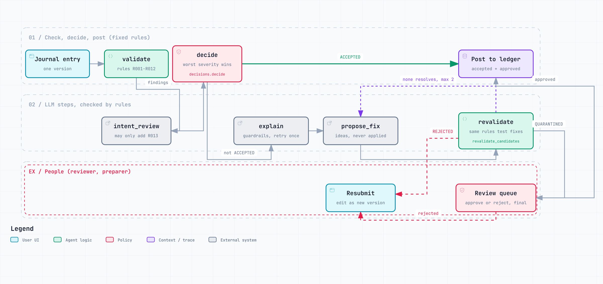
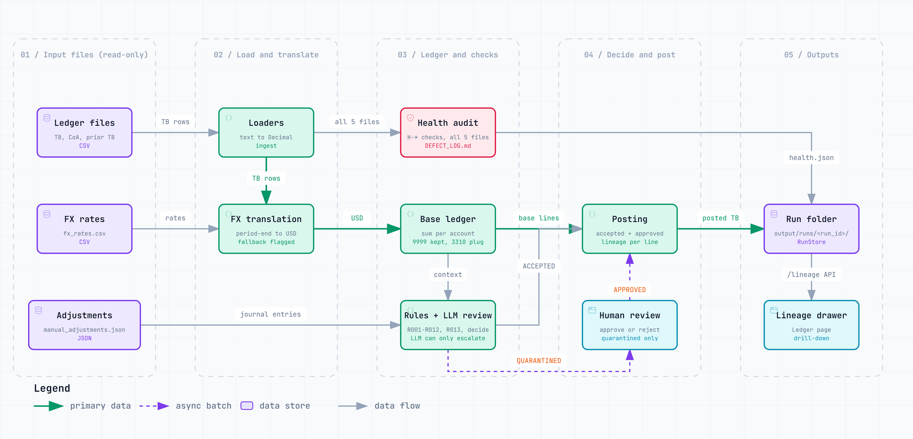
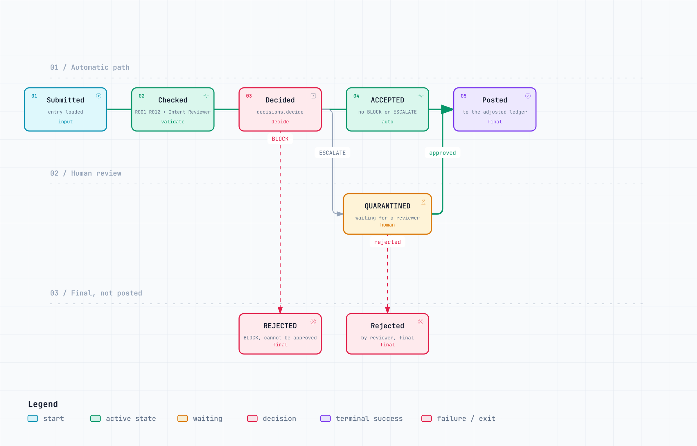
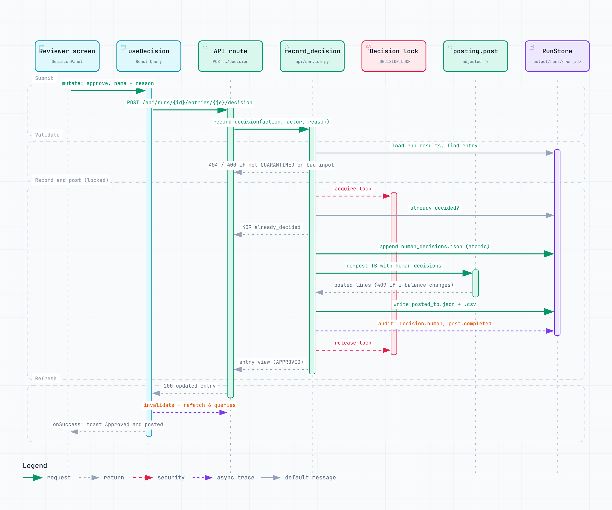

# fin-adjustments-agent

## What it is

This is a prototype tool for month-end accounting work. It checks **manual journal entries** (hand-made corrections to the books) before they are posted.

It reads four kinds of input:

- a **trial balance** (the list of every account and its total), in several currencies,
- a **chart of accounts** (the official list of accounts),
- **FX rates** (currency exchange rates),
- a batch of 10 manual journal entries.

How it works:

1. It checks the input files for data problems.
2. Fixed, written rules check every entry.
3. Each entry gets one decision: **ACCEPTED**, **REJECTED** or **QUARANTINED** (held for a person to review).
4. An AI language model (LLM) helps only with words. It explains problems, suggests fixes and flags a suspicious purpose. It never does the maths. It never sees the trial balance.
5. Accepted entries are posted to the trial balance.
6. Every posted number can be traced back to its source rows, FX rate and journal lines.

**Result on the delivered data** (run `0f6fe063474d`):

| Decision | Count | Entries |
|---|---:|---|
| ACCEPTED | 6 | JE-001, JE-004, JE-006, JE-007, JE-009, JE-010 |
| REJECTED | 2 | JE-002, JE-008 |
| QUARANTINED | 2 | JE-003, JE-005 |

The data health check found **20 problems (2 critical)** in the 5 input files. The brief listed 10.

## What is in scope, and what is not

**In scope:**

- Read the trial balance and convert all currencies to USD (needed before posting).
- Read the chart of accounts and build its account tree.
- Data health check of all input files.
- Check each entry, decide, explain, and suggest fixes.
- Human review of quarantined entries.
- Post accepted entries, with full lineage (a trail back to the source of each number).
- Export the adjusted trial balance.
- Logs of every step, automatic tests of quality (evals), and a web screen (UI).

**Small extra:** an **impact preview** for each entry. It shows which balance sheet and profit-and-loss subtotals the entry changes, and by how much. This is simple adding up over the account tree (`src/finagent/adjustments/impact.py`). It does not build financial statements.

**Out of scope** (only described in the architecture document):

- Building the four financial statements.
- Intercompany eliminations (removing balances between group companies).
- Restating prior periods.
- A full tool to map accounts to the chart of accounts.

## How to run (3 commands)

```
uv sync
uv run finagent run
uv run finagent serve      # then open http://localhost:8000
```

**What you need:**

- [uv](https://docs.astral.sh/uv/), a Python tool manager. It downloads Python 3.12 for you if needed.
- **No API key.** By default the app replays saved AI answers from `evals/cassettes/`.
- **Node 20 or newer, once**, to build the web screen. The built screen (`frontend/dist`) is not stored in git. On a fresh copy, build it once:

  ```
  cd frontend && npm ci && npm run build
  ```

  Without this step the API still works, but the web page does not load. The Docker image builds the screen for you.

If no run exists yet, `finagent serve` makes one first (in cassette mode). So a fresh copy shows data at once.

## All commands

| Command | What it does |
|---|---|
| `uv run finagent audit [--fx-policy block\|fallback_average\|fallback_opening]` | Checks the input files for data problems. Writes `output/DEFECT_LOG.md` and `output/health.json`. |
| `uv run finagent run [--fx-policy …] [--llm-mode cassette\|live\|off]` | Runs the full process. Writes to `output/runs/<run_id>/`. Exits with code 1 if the run status is not OK. |
| `uv run finagent eval [--llm-mode cassette\|live\|off]` | Runs the quality tests. Writes `output/evals/report.md` and `report.json`. Exits with code 1 if the pass mark is not met. |
| `uv run finagent serve [--port 8000] [--host 127.0.0.1]` | Starts the API and web screen. Use `--host 0.0.0.0` inside a container. |
| `uv run finagent show [RUN_ID]` | Prints a saved run: summary, metrics, checks and decisions. Default is `latest`. |
| `uv run finagent record-cassettes [--clean]` | Calls the real AI service and saves the answers to `evals/cassettes/<role>/*.json`. Needs an API key. `--clean` deletes old answers first. |
| `uv run pytest -q` | Runs the code tests. |
| `uv run ruff check . && uv run ruff format --check .` | Checks code style. |
| `uv run pyright` | Checks types (strict on `src/`). |

The FX policy decides what to do when an exchange rate is missing: `block` (stop), `fallback_average` (use the average rate, the default) or `fallback_opening` (use the opening rate).

The same checks run automatically on every push (`.github/workflows/ci.yml`). This includes `finagent audit`, `finagent eval`, and `npm run lint` and `npm run build` for the web screen.

## AI (LLM) modes

| Mode | What it means | API key needed |
|---|---|---|
| `cassette` (default) | Replays saved AI answers from `evals/cassettes/`. No network. If a saved answer is missing, the app reports it and uses a fixed text template. | No |
| `off` | No AI at all. Every AI step uses its fixed text template. | No |
| `live` | Calls the real AI service. First choice: Google `gemini-2.5-flash`. Backup: Groq `openai/gpt-oss-120b`. | Yes |
| `record` | Like `live`, but also saves each new answer. Saved answers are reused, never overwritten. Set it with `llm.mode` in the config, or use `record-cassettes`. `--llm-mode` does not accept it. | Yes |

**The AI does not decide.** Decisions come from the rules. The only exception: the intent reviewer (the AI step that looks for a suspicious purpose) can **add** a rule R013 warning that sends an entry to review. It can never remove or soften a rule finding. Every AI answer is checked by safety checks in `src/finagent/llm/guardrails.py`. If a check fails, the app retries once, then uses the fixed template.

**To switch to live mode:**

```
cp .env.example .env              # set GOOGLE_API_KEY; GROQ_API_KEY is an optional backup
uv sync --extra llm-google --extra llm-groq
uv run finagent run --llm-mode live          # or set LLM_MODE=live in .env
```

**To record new saved answers:**

```
uv run finagent record-cassettes            # records only missing answers
uv run finagent record-cassettes --clean    # deletes all saved answers and records again
uv run finagent run --llm-mode cassette     # replay
```

You can change the provider and model with `LLM_PROVIDER`, `LLM_MODEL`, `LLM_FALLBACK_PROVIDER` and `LLM_FALLBACK_MODEL` (see `.env.example`). Any setting can also be changed with a variable that starts with `FINAGENT__`, for example `FINAGENT__FX__MISSING_RATE_POLICY=block`.

## Docker

```
docker build -t fin-adjustments-agent .
docker run -p 7860:7860 fin-adjustments-agent
# open http://localhost:7860
```

The image builds the web screen, then serves the API and the screen from one program on port 7860. It runs in cassette mode, so no secrets are needed. Full steps and a problem-solving table: [`docs/DEPLOY.md`](docs/DEPLOY.md).

## Hugging Face Spaces

Live demo: `<your-space-url>`

The same Dockerfile runs as a Hugging Face Docker Space without changes. Steps: [`docs/DEPLOY.md`](docs/DEPLOY.md).

## Screenshots

All four were taken in cassette mode from run `0f6fe063474d` (the run in `output/runs/`).

**Data health.** 20 problems across the 5 input files. Each one shows its evidence and the policy used. The side panel shows how much the trial balance is out of balance under each FX policy.


**Review queue, JE-003 open.** A quarantined FX revaluation entry (rule R007: the FX effect may be counted twice). It shows the AI explanation, a question for the person who made the entry, and the impact preview.


**Adjusted trial balance, lineage for account 2120 Accrued Expenses.** The line (credit 2,075,000.00) splits into: the trial balance row (credit 1,150,000.00), the USD rate (1.0), JE-001 (credit 850,000.00) and JE-009 (credit 75,000.00).


**JE-008 entry page with trace.** Rejected by rule R005 (the entry changes nothing). Rule R011 adds a warning: no group company is named on the other side. The intent reviewer added an R013 warning. Two suggested fixes were checked again by the rules. The trace shows each step.


## Diagrams

The images below match your GitHub theme (light or dark).
Each one also has an interactive version in `docs/diagrams/` (`.html`).
GitHub shows `.html` files as code, so download the file and open it in a browser.
The interactive version lets you zoom, search and trace each connection.

### 1. System architecture

The main parts of the system and how they connect.
The "Deterministic kernel" box does all the maths and sees the trial balance. The "LLM side" box sees only one entry and its findings.

<picture>
  <source media="(prefers-color-scheme: dark)" srcset="docs/diagrams/img/architecture-dark.png">
  
</picture>

### 2. What happens to one journal entry

Rules check the entry, then `decide` picks the result. The LLM can only add a finding, never remove one.
Proposed fixes are re-checked by the same rules and are never applied automatically.

<picture>
  <source media="(prefers-color-scheme: dark)" srcset="docs/diagrams/img/entry-workflow-dark.png">
  
</picture>

### More diagrams

<details>
<summary><b>Data flow and lineage</b>: how each posted number links back to its source rows, FX rate and journal lines</summary>
<br>

<picture>
  <source media="(prefers-color-scheme: dark)" srcset="docs/diagrams/img/data-lineage-dark.png">
  
</picture>

</details>

<details>
<summary><b>Entry lifecycle</b>: the states an entry can be in and how it moves between them</summary>
<br>

<picture>
  <source media="(prefers-color-scheme: dark)" srcset="docs/diagrams/img/decision-lifecycle-dark.png">
  
</picture>

</details>

<details>
<summary><b>Approve and post, step by step</b>: what happens when a reviewer approves a quarantined entry, including the error replies</summary>
<br>

<picture>
  <source media="(prefers-color-scheme: dark)" srcset="docs/diagrams/img/approve-sequence-dark.png">
  
</picture>

</details>

| Interactive file | Image (light / dark) |
|---|---|
| [`architecture.html`](docs/diagrams/architecture.html) | [light](docs/diagrams/img/architecture-light.png) · [dark](docs/diagrams/img/architecture-dark.png) |
| [`entry-workflow.html`](docs/diagrams/entry-workflow.html) | [light](docs/diagrams/img/entry-workflow-light.png) · [dark](docs/diagrams/img/entry-workflow-dark.png) |
| [`data-lineage.html`](docs/diagrams/data-lineage.html) | [light](docs/diagrams/img/data-lineage-light.png) · [dark](docs/diagrams/img/data-lineage-dark.png) |
| [`decision-lifecycle.html`](docs/diagrams/decision-lifecycle.html) | [light](docs/diagrams/img/decision-lifecycle-light.png) · [dark](docs/diagrams/img/decision-lifecycle-dark.png) |
| [`approve-sequence.html`](docs/diagrams/approve-sequence.html) | [light](docs/diagrams/img/approve-sequence-light.png) · [dark](docs/diagrams/img/approve-sequence-dark.png) |

The images were exported with the diagram viewer's own PNG export. The `.json` files are the diagram sources.

## How it is built (short)

- **Fixed rules first.** The app reads the files, cleans up formats, converts currencies and builds the account tree. Then 12 rules (R001 to R012) check each entry. Each rule is one file with its own test file. Each problem found (a "finding") comes with its evidence.
- **Decisions are code, not AI.** Any BLOCK finding means REJECTED. Any ESCALATE finding means QUARANTINED. Otherwise the entry is ACCEPTED.
- **Limits on the AI.** There are three AI roles: intent reviewer, explainer and fix proposer. They see only the one entry and its findings. Entry descriptions and memos are marked as untrusted text. Every answer must match a fixed format and pass the safety checks. The reviewer can only add warnings.
- **Fixes are only suggestions.** Suggested fixes are checked by the same rules and attached to the entry. Nothing is changed automatically.
- **A person has the final say.** Only QUARANTINED entries can be approved or rejected by a person. Human decisions are saved apart from the system results and do not change the run id.
- **Posting with lineage.** Every posted line can be split into its source rows, FX rates, journal lines and the translation difference line (the gap left by currency conversion). Automatic checks confirm the lineage adds up.
- **Repeatable runs.** The run id is a fingerprint (hash) of the inputs, settings and code version. In cassette mode, the same inputs give exactly the same `decisions.json`. The steps run as a LangGraph graph (a library that runs steps in a fixed order).

Full design: [`docs/ARCHITECTURE.md`](docs/ARCHITECTURE.md).

## Logs and monitoring

Each run writes a step-by-step log (a "trace") to `output/traces/<run_id>.jsonl`. It records:

- each step's start, end and time taken,
- each rule result with its evidence,
- each AI call (role, model, mode, prompt fingerprint, whether a saved answer was used, time, rough size),
- safety check results, decisions and final checks.

`uv run finagent show` prints the run's numbers. For run `0f6fe063474d`: auto-accept rate 0.6000, quarantine rate 0.2000, reject rate 0.2000, 18 AI calls, saved-answer hit rate 1.0000, safety fallback rate 0.0000, middle (p50) AI call time 0.515 ms.

**Optional: Langfuse** (an online tool to view and share traces). Nothing changes unless you turn it on:

```
uv sync --extra observability
# .env: LANGFUSE_PUBLIC_KEY=..., LANGFUSE_SECRET_KEY=..., LANGFUSE_HOST=https://cloud.langfuse.com
FINAGENT__OBSERVABILITY__LANGFUSE_ENABLED=true uv run finagent run --llm-mode live
```

Live AI calls then appear in Langfuse, one trace per call. To share one: open the trace, click **Share**, copy the public link, and set it as `VITE_LANGFUSE_TRACE_URL`. The About page then links to it. Cassette mode makes no real AI calls, so it sends nothing to Langfuse. The local trace file is always the main record.

## Deliverables

| Deliverable | Where |
|---|---|
| Architecture | [`docs/ARCHITECTURE.md`](docs/ARCHITECTURE.md) and [`docs/ARCHITECTURE.pdf`](docs/ARCHITECTURE.pdf) |
| Reflection | [`docs/REFLECTION.md`](docs/REFLECTION.md) |
| AI usage | [`docs/AI_USAGE.md`](docs/AI_USAGE.md) |
| Clarifying questions | [`docs/07_CLARIFYING_QUESTIONS.md`](docs/07_CLARIFYING_QUESTIONS.md) |
| Assumptions and build decisions | [`docs/08_ASSUMPTIONS.md`](docs/08_ASSUMPTIONS.md) |
| Engineering rules | [`docs/ENGINEERING_RULES.md`](docs/ENGINEERING_RULES.md) |
| Defect log | [`output/DEFECT_LOG.md`](output/DEFECT_LOG.md) (machine-readable: [`output/health.json`](output/health.json)) |
| Output run | [`output/runs/0f6fe063474d/`](output/runs/0f6fe063474d/): `manifest.json`, `decisions.json`, `posted_tb.csv`, `audit_log.jsonl`. The file `output/runs/LATEST` names this run. |
| Traces | [`output/traces/0f6fe063474d.jsonl`](output/traces/0f6fe063474d.jsonl) |
| Evals | [`output/evals/report.md`](output/evals/report.md) (and `report.json`). Result: PASSED, decision accuracy 1.0000 on 10 golden + 17 synthetic cases. |
| Screenshots | [`docs/screenshots/`](docs/screenshots/) |
| Diagrams | [`docs/diagrams/`](docs/diagrams/) (see [Diagrams](#diagrams)) |
| Deployment guide | [`docs/DEPLOY.md`](docs/DEPLOY.md) |

## Folder layout

```
.
├── config/default.yaml      FX policy, materiality, limits, AI settings
├── inputs/                  raw data as delivered (read-only, never cleaned)
├── src/finagent/
│   ├── domain/  ingest/     data models, money, account tree; file loading, FX, health checks
│   ├── adjustments/         rules/ (one per file), validator, decisions, posting, lineage, impact
│   ├── llm/  graph/         AI providers, saved answers, safety checks, roles; LangGraph steps
│   ├── observability/  store/  api/
│   └── cli.py
├── evals/                   expected results, synthetic test cases, cassettes/
├── tests/                   same structure as src/
├── frontend/                web screen (Vite + React + TypeScript)
├── docs/                    specs, deliverables, screenshots, diagrams
├── output/                  DEFECT_LOG.md, health.json, runs/, traces/, evals/
└── Dockerfile
```

## Note on committing the run

Git ignores `output/runs/` and `output/traces/`, because every run writes there. To include the finished run in git, add it by force:

```
git add -f output/runs/0f6fe063474d output/runs/LATEST output/traces/0f6fe063474d.jsonl
```
